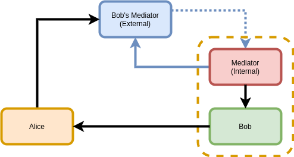
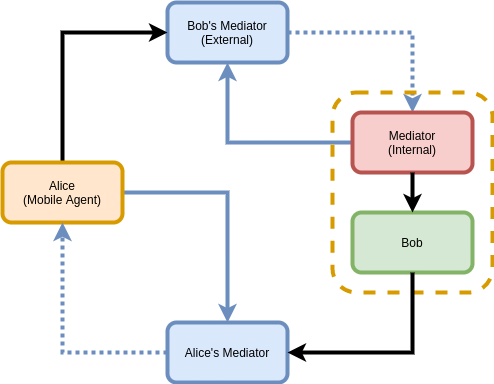

# Quickstart

## To create and activate a virtual environment, run within the root directory:
  - `python3 -m venv env`
  - `source env/bin/activate`

## To run the demo setup:
  - `docker-compose up --build; docker-compose down`

## Services started by the above command:
- **Proxy**: The mediator inside the firewall which connects to the external mediator.
- **Agent**: The agent that is sending and receiving messages through the mediators.
- **Mediator-tunnel**: A tunnel through which the external mediator transfers information.
- **Reverse-proxy**: A service that redirects traffic from one endpoint to another.
- **Mediator**: The external mediator that connects to the internal mediator from outside of the firewall.
- **Setup**: Builds the context and sets the environment variables.

  - The MessageRetriever retrieves messages by opening a websocket connection and continuously polling for messages using a trust ping with response_requested set to false while the websocket connection is open.

# Setup

Steps to set up and connection the mediators:
1. Retrieve invitation from mediator
    - Use the `acapy_client` to create an invitation request for the external mediator and return the invitation URL.
2. Receive invitation in proxy
    - Using AsyncClient, make an HTTP post request to allow the proxy mediator to receive the invitation from the external mediator. The proxy mediator and external mediator will now be connected.
3. Retrieve invitation from proxy
    - Using AsyncClient, make an HTTP get request to retrieve the invitation from the proxy mediator.
4. Receive proxy invitation on the agent
    - Proxy and agent will now be connected.
5. Request mediation from proxy
    - The agent requests mediation from the proxy mediator. Proxy has now granted mediation to agent.
6. Set proxy as default mediator
    - Proxy mediator will now be the default mediator for the agent.

This setup is implemented in `docker/setup/main.py` and `int/tests/conftest.py`. These steps can be used directly or in your own setup.

The proxy mediator uses an Aries Askar store for secure connection persistence.

# Introduction

This project is a service deployed "at the edge" that polls for messages from a
mediator and forwards/relays the messages to an agent service that does not
support polling for messages from a mediator.

# Context

The concept of Mediation makes it possible for agents to be able to reliably
receive messages even while not being directly reachable over the internet or
some other delivery mechanism. This covers a wide range of scenarios, including:

- A phone that loses service while driving through Wyoming
- A phone or other mobile device that runs out of battery
- A device that frequently switches networks and so does not have a reliable IP
  address
- A device that is connected to the internet behind a firewall

Mobile agents are well aware of these intermittent connectivity scenarios and
are architected to rely on mediation services to receive messages. Cloud agents,
on the other hand, are architected to have reliable connectivity but could
feasibly be deployed behind a firewall. These agents are not well suited to
relying on mediation services to receive messages while behind a firewall.

Rather than introducing the complexity of supporting both actively polling
messages from a mediator and being able to asynchronously receive messages over
a transport, such an agent could use a separate service that implements the
active polling and then forwards/relays the retrieved messages to it.

# System Architecture

## Alice and Bob (Alice domain simplified)

## Alice and Bob (Alice domain depicted)

# Goals 

- Create a functional mechanism for running cloud agents behind a firewall.
- The connected cloud agent treats the proxy mediator exactly as it would a
  normal mediator.
- Proxy mediator persists configuration across restarts.
- Proxy mediator is configured through command line arguments or environment
  variables.
- Package as container and python package.
- Simple and fast to implement.

# Non-Goals

- Create a full mediator solution.
- Implement an Admin API to control the proxy mediator (perhaps with the
  exception of retrieving an invite as this is helpful in automating setup).

# Assumptions

To simplify a first pass at this mediation service, we will make the following
assumptions:

- The proxy mediator services exactly one agent.
- The proxy mediator implements only the connection and coordinate mediation
  protocols (maybe discover features, pickup protocols).
    - Or would it be better to use DID Exchange protocol?
- The proxy mediator will automatically accept mediation requests.
- The proxy mediator will more or less ignore keylist updates and assume
  everything it receives can be passed on to the agent.
- The proxy mediator will hold no more state than is absolutely necessary:
    - Mediator connection info (once set)
    - Agent connection info (once set)
- The proxy mediator may reuse it's verkey with the mediator as the routing key
  reported to the agent.
